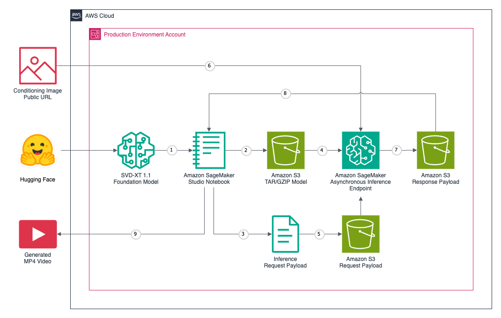

# Stable Video Diffusion XT 1.1 on Amazon SageMaker

Stability AI's [Stable Video Diffusion XT (SVT-XT) 1.1](https://medium.com/r/?url=https%3A%2F%2Fstability.ai%2Fstable-video) foundation model is a diffusion model that takes in a still image as a conditioning frame and generates a video from it. The [Jupyter Notebook](svd_xt_demo.ipynb) walks through creating and invoking an [asynchronous inference endpoint](https://docs.aws.amazon.com/sagemaker/latest/dg/async-inference.html) backed by the SVT-XT foundation model on Amazon SageMaker.

## Architecture



## Wide-format Videos

<table>
   <tr>
      <td>
      </br><a href="https://www.pexels.com/photo/red-alfa-romeo-c4-on-road-near-trees-210019">Source image</a></td>
      <td>
      </br><a href="https://www.pexels.com/photo/photo-of-man-riding-bicycle-4054069">Source image</a></td>
   </tr>
   <tr>
      <td>
      </br><a href="https://unsplash.com/photos/two-koi-fish-swimming-DpI3yVVeJyA">Source image</a></td>
      <td>
      </br><a href="https://www.pexels.com/photo/time-lapse-photography-of-waterfall-2406388">Source image</a></td>
   </tr>
   <tr>
      <td>
      </br><a href="https://www.pexels.com/photo/seinboat-sunrise-20544112">Source image</a></td>
      <td>
      </br><a href="https://cdn-lfs.huggingface.co/datasets/huggingface/documentation-images/83e7729b516ba725cb2283eb397ec2c77fc4b120f52a83801f610eac353b63c4?response-content-disposition=inline%3B+filename*%3DUTF-8%27%27rocket.png%3B+filename%3D%22rocket.png%22%3B&response-content-type=image%2Fpng&Expires=1713928309&Policy=eyJTdGF0ZW1lbnQiOlt7IkNvbmRpdGlvbiI6eyJEYXRlTGVzc1RoYW4iOnsiQVdTOkVwb2NoVGltZSI6MTcxMzkyODMwOX19LCJSZXNvdXJjZSI6Imh0dHBzOi8vY2RuLWxmcy5odWdnaW5nZmFjZS5jby9kYXRhc2V0cy9odWdnaW5nZmFjZS9kb2N1bWVudGF0aW9uLWltYWdlcy84M2U3NzI5YjUxNmJhNzI1Y2IyMjgzZWIzOTdlYzJjNzdmYzRiMTIwZjUyYTgzODAxZjYxMGVhYzM1M2I2M2M0P3Jlc3BvbnNlLWNvbnRlbnQtZGlzcG9zaXRpb249KiZyZXNwb25zZS1jb250ZW50LXR5cGU9KiJ9XX0_&Signature=pokKCBg3BgH-9jjbWu1DnDc%7EsmHLz09YNgCAhcfgTXSDXJxQUaQ2JoiT7ofYcogeAGYLf%7EJhUAhfY2eDIWdDABVnbO79iTfcxm%7EmadxCU2o4PCXhNW0IvB67Q2G2hWwYL4mzaIVc2ko5PN-jsAMrY-X-XZn2Pt71C9K-E3MpL%7Ea1nprA5c%7EuY1aeE4gAjmAJe337bJrL5DPB2C1cIp0PnZBcZKoNnB3bwkC-y3l%7ENDt8KThha90ULy0qQra6vG4rOaz-Pljhb8INtlubZxkUBTwN2sqoUkDYSByG2pc7kcDqJmhWqaeOT7nUZ5JkhZptoHtWcsdXHey-iWnnlH7JdA__&Key-Pair-Id=KVTP0A1DKRTAX">Source image</a></td>
   </tr>
</table>

## Tall-format Videos

<table>
   <tr>
      <td>
      </br><a href="https://www.pexels.com/photo/a-shot-of-steaming-pot-with-a-and-glass-with-a-beverage-10351409">Source image</a></td>
      <td>
      </br><a href="Photo by Pixabay: https://www.pexels.com/photo/close-up-of-beer-glass-against-black-background-255483">Source image</a></td>
   </tr>
   <tr>
      <td>
      </br><a href="https://www.pexels.com/photo/red-smoke-illustration-604671">Source image</a></td>
      <td>
      </br><a href="https://www.pexels.com/photo/close-up-of-beer-glass-against-black-background-255483/">Source image</a></td>
   </tr>
</table>
</br>

## Optional: Local Environment

Setup local environment to modify `inference.py` file.

```sh
python3 -m pip install virtualenv -Uq
virtualenv svd-venv
python3 -m venv svd-venv

source svd-venv/bin/activate
```

```sh
python3 -m pip install -r requirements.txt -Uq
```

## References

- <https://github.com/huggingface/notebooks/blob/main/sagemaker/23_stable_diffusion_inference/sagemaker-notebook.ipynb>
- <https://github.com/huggingface/diffusers/issues/6956>
- <https://huggingface.co/stabilityai/stable-video-diffusion-img2vid-xt/tree/main>
- <https://www.philschmid.de/sagemaker-stable-diffusion>
- <https://huggingface.co/docs/diffusers/en/using-diffusers/svd>
- <https://github.com/philschmid/huggingface-inferentia2-samples/blob/main/stable-diffusion-xl/sagemaker-notebook.ipynb>
- <https://github.com/aws-samples/amazon-sagemaker-asynchronous-inference-computer-vision/blob/main/mask-rcnn-async-inference.ipynb>

---

_The contents of this repository represent my viewpoints and not of my past or current employers, including Amazon Web Services (AWS). All third-party libraries, modules, plugins, and SDKs are the property of their respective owners._
